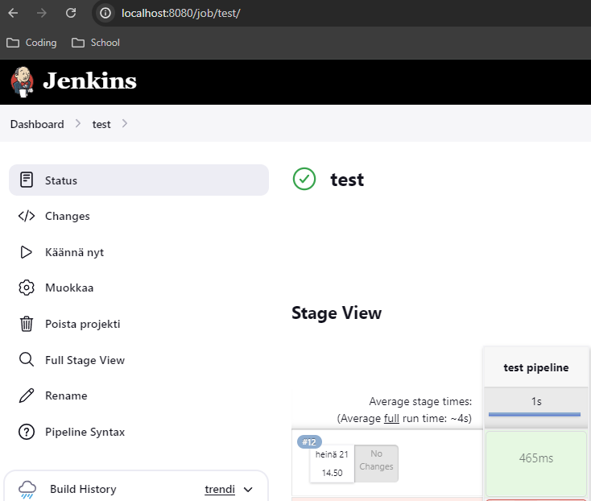

# jenkins-on-kubernetes

I am learning about deploying Jenkins to Kubernetes. Materials used: https://www.youtube.com/watch?v=eRWIJGF3Y2g, https://www.jenkins.io/

## Create namespace for jenkins
```sh
kubectl create ns jenkins
```

## Run the Kubernetes configuration in the root of this repository
```sh
kubectl -n jenkins apply -f ./
```

## Get pods in jenkins namespace and copy the name of the pod running
```sh
kubectl get pods -n jenkins
```

## Get initial Jenkins password from logs
```sh
kubectl -n jenkins logs <pod-name>
```

## Port forward Jenkins UI to localhost:8080
```sh
kubectl -n jenkins port-forward <pod-name> 8080
```

## Open localhost:8080 in browser
1. Enter the password to UI
2. Install suggested plugins
3. Install kubernetes plugin
4. Restart Jenkins

## Create a Kubernetes Cloud
1. Manage Jenkins -> Clouds
2. New Cloud

### Cloud Kubernetes Configuration
```
name: kubernetes
https certificate check: false
kubernetes_url: https://kubernetes.default:443
kubernetes_namespace: jenkins
credentials: jenkins (domain: Global, kind: Kubernetes Service Account)
jenkins_url: http://jenkins
jenkins_tunnewl: jenkins:50000
pod_label:
    - key: jenkins
    - value: slave

add pod template
name: jenkins-slave
namespace: jenkins
labels: jenkins-slave
Container Template:
    name: jnlp
    docker_image: jenkins/inbound-agent:jdk11
    working_directory: /home/jenkins/agent
    Allocate pseudo-TTY: true
Host Path Volume:
    host_path: /var/run/docker.sock
    mount_path: /var/run/docker.sock
timeout for jenkins connection: 300
```

## Create a pipeline and test if the agent works

Pipeline script:
```
node('jenkins-slave') {
     stage('test pipeline') {
        sh(script: """
            echo "hello"
        """)
    }
}
```

## Run the pipeline


Build was success!



The build was done by a kubernetes pod that has a jenkins slave image


